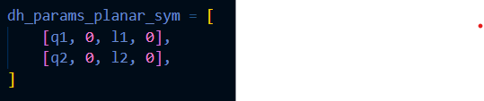
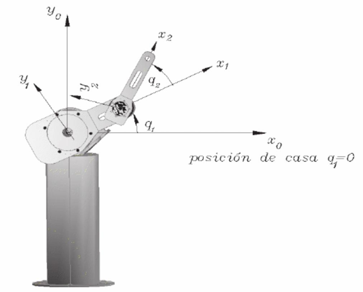
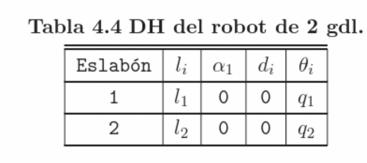
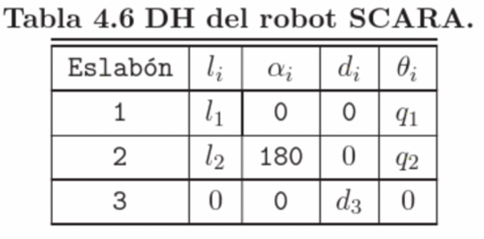
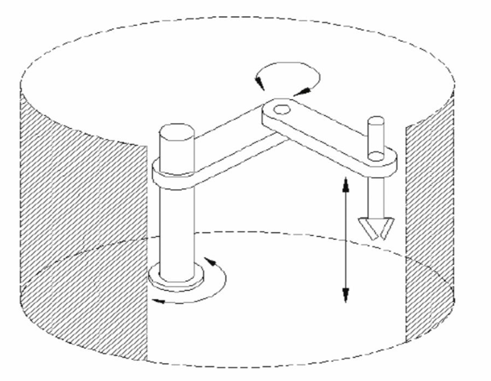
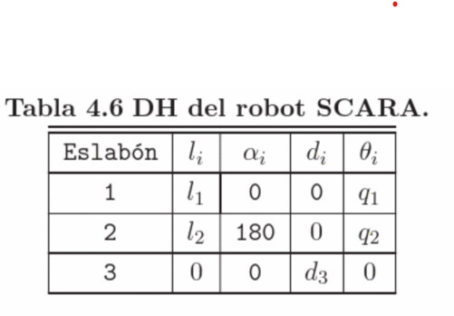
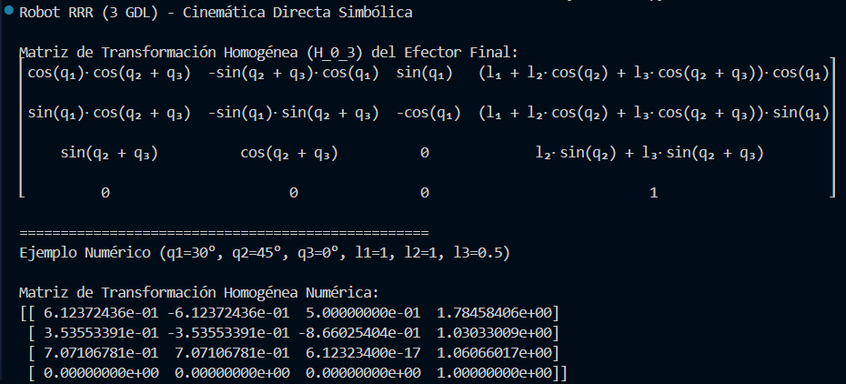

 
# PROYECTO CINEMÁTICA DIRECTA EN REPOSITORIO DE GIT
## Introducción
La cinemática directa es esencial en robótica porque permite calcular la posición y orientación del efector final a partir de las variables articulares. En este proyecto se implementa la cinemática directa simbólica de tres configuraciones de robots: un planar RR (2 GDL), un antropomórfico RRR (3 GDL) y un SCARA (RRP), utilizando la metodología de Denavit-Hartenberg (DH).

El desarrollo se realizó en Python, empleando las librerías NumPy y Sympy para el manejo de cálculos numéricos y simbólicos. Se generaron matrices de transformación homogénea que describen el movimiento del robot, siguiendo los parámetros DH del libro Control de robots manipuladores de Fernando Reyes Cortés.

## Metodología
La metodología para este proyecto se dividió en dos niveles: la implementación de funciones base para la cinemática directa y la aplicación de estas funciones a tres configuraciones de robots manipuladores (RR, RRR y RRP/SCARA).

### 1.Preparación del entorno y librerías
•	El proyecto se desarrolló en Python, utilizando las librerías:

   -NumPy: para cálculos numéricos.
   
   -Sympy: para cálculos simbólicos.
   
•	Se organizaron los programas en módulos separados:

- `forward_kinematics_dh.py`: implementa el cálculo numérico de matrices DH.
- `forward_kinematics_dh_symbolic.py`: implementa el cálculo simbólico de matrices DH.
- `forward_kinematics_dh_class.py`: integra ambas funcionalidades en una clase reutilizable.

### 2.Definición de parámetros Denavit-Hartenberg (DH)
• Para cada robot se elaboró la tabla DH en el formato estándar [θ_i,d_i,a_i,α_i].

•Los parámetros fueron obtenidos del libro Control de robots manipuladores de Fernando Reyes Cortés (págs. 226–237).

•Estos parámetros fueron implementados en archivos independientes:

	RR.py → robot planar de dos grados de libertad (RR).
   
	RRR.py → robot antropomórfico de tres grados de libertad (RRR).
   
	RRP.py → robot SCARA con configuración RRP.

### 3.Implementación de la cinemática directa
Cada archivo de robot sigue la misma estructura

**Definición de variables simbólicas:**

-Ejemplo (RR): q1, q2, l1, l2 = sp.symbols('q1 q2 l1 l2').

**Definición de la tabla DH:**

-Ejemplo (RR):

**Cálculo simbólico** de la matriz de transformación homogénea mediante:

-`ForwardKinematicsDH.symbolic(dh_params)`

•	El resultado se imprime en consola con -`sp.pprint()`

**-Ejemplo numérico** para validar los cálculos:

•	Se sustituyen valores de ángulos y longitudes (ejemplo: q1=45°, q2=-45°, l1=l2=1 en el RR).

•	Se obtiene la matriz numérica con -`ForwardKinematicsDH.numeric(dh_params)`

### 4.Robots analizados
**a)Robbot Planar RR(2GDL)**

**Archivo:** `RR.py`

**Definición de símbolos:** q_1,q_2,l_1,l_2

**Tabla DH:**

**Cálculo simbólico:** se genera la matriz homogénea H_0^2con `ForwardKinematicsDH.symbolic()`

**Ejemplo numérico:** q_1=45^∘,q_2=-45^∘,l_1=l_2=1

**Resultado esperado:** la posición final corresponde al efector en un plano con dos rotaciones consecutivas.

**b)Robot Antropomórfico RRR (3 GDL)**

**Archivo:** `RRR.py`

**Definición de símbolos:** q_1,q_2,q_3,l_1,l_2,l_3

**Tabla DH:**

**Cálculo simbólico:** se obtiene la matriz H_0^3que describe la orientación tridimensional del efector.

**Ejemplo numérico:** q_1=30^∘,q_2=45^∘,q_3=0^∘,l_1=l_2=1,l_3=0.5

**Resultado esperado:** la matriz homogénea incluye rotaciones en 3D, representando un brazo articulado antropomórfico.

**c)Robot SCARA (RRP)**

**Archivo:** `RRP.py`

**Definición de símbolos:** q_1,q_2,d_3,l_1,l_2

**Tabla DH:**

**Cálculo simbólico:** se genera la matriz H_0^3considerando dos rotaciones y un desplazamiento prismático.

**Ejemplo numérico:** 	q_1=0^∘,q_2=90^∘,d_3=0.1,l_1=l_2=0.5

**Resultado esperado:** el efector final se desplaza en el plano XY con movimientos rotacionales y en el eje Z mediante la articulación prismática.

## Resultados obtenidos
**Matriz de transformación homogénea para RR:**

**Matriz de transformación homogénea para RRR:**

**Matriz de transformación homogénea para RRP:**

## Conclusión
El proyecto permitió implementar con éxito la **cinemática directa simbólica** de tres configuraciones de robots manipuladores (RR, RRR y SCARA) mediante Python. La utilización de los parámetros Denavit-Hartenberg y las librerías **Sympy** y **Numpy** facilitó el cálculo y verificación de las matrices de transformación homogénea.
